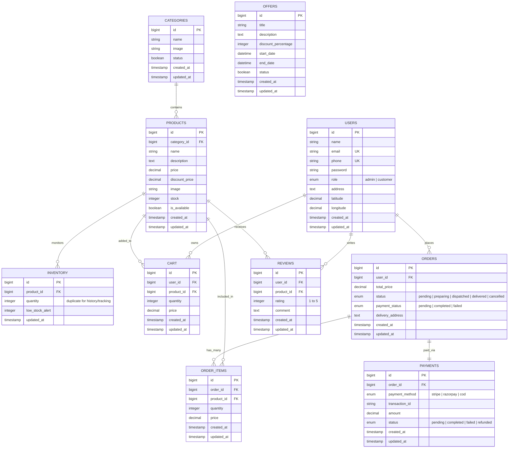

# Entity-Relationship Diagram (ERD)

A detailed blueprint of the MySQL relational database architecture underlying FoodHub.

## Schema Explanation

- **Users**: Central point to manage application access. Has a specific `role` enum field restricting Admin endpoints, along with geolocation inputs.
- **Categories & Products**: Form the base menu functionality. The application supports an `is_available` flag to quickly disable a product overriding strictly manual stock level checks.
- **Inventory**: Serves as a more granular tracker over simple row manipulation per transaction—monitoring low bounds.
- **Orders**: Relates 1:N with `ORDER_ITEMS`. Follows a strict enumerated status pipeline tracking prep and logistic delivery. A single reference holds its respective payment mechanism record `PAYMENTS`.
- **Cart**: Functions as a temporary cache of what the user is preparing to purchase. Once transitioning to checkout, data persists into `ORDERS` & `ORDER_ITEMS`.
