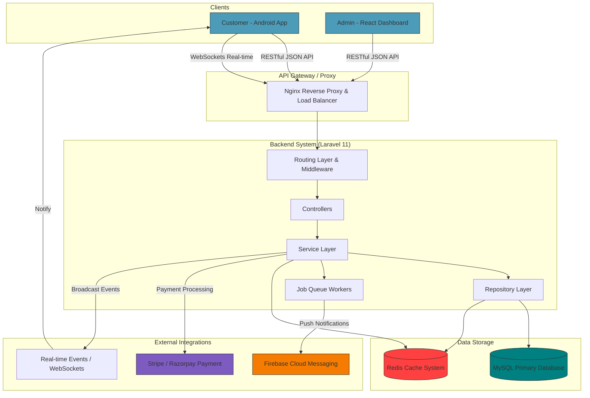

# System Design Workflow (FoodHub)

A comprehensive look at how individual services run and interact with the backend API.

## System Workflow Description

1. **Client Interaction**: Clients (Admin Dashboard or Mobile User) send requests via standard HTTP methods or connect via WebSockets to listen to server-side events. Nginx sits in front and acts as a load balancer and proxy.
2. **Controllers & Validation**: Requests land on Laravel matching Route, go through the Middleware (for example, JWT authentication verification via Sanctum). Then, Controllers handle incoming formatted request validation and pass execution to the Services.
3. **Service layer**: Represents the business logic interface. Validates things like low-stock verification or applying a coupon discount.
4. **Repositories**: Act as an abstraction layer above Eloquent ORM. Perform read/writes to MySQL or Redis.
5. **Background Workers**: Sending order notifications, updating analytics, or interacting with Firebase is sent over to queue workers that run independently.
6. **Integrations**: Interactions directly hit third-party API gateways. WebSockets broadcast state updates, allowing user views to alter automatically.
